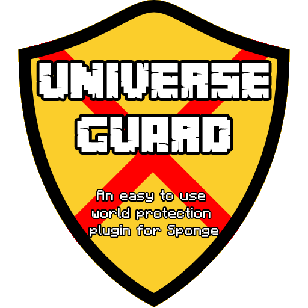

# UniverseGuard2 

Universe Guard provides a simple command interface to protect some areas in your Minecraft Server world. 

# How it works
Universe Guard is really easy to use. It all starts with a single command, /rg, wich gives you the Region Selector.
With that you can define a Region and setting different things, such as flags, spawn point, assign it to some players, disable commands
and so on. More informations about what you can set inside a Region can be found on the Wiki.

# Requirements
Universe Guard do not require any other plugin or mod to be installed on your server. 

# Compatibility
Universe Guard has been build with the version 6.0.0 of SpongeAPI and has been tested with Sponge for Minecraft 1.10.2. By the way, this
should also work with newest version of Sponge, but at the time I'm writing this document tests with other version are still in progess.

# How to contribute
Since is an open source project anyone can help the development. So if you have any idea on how to improve the plugin, 
or how to fix some bugs feel free to write it on the Official Sponge page or in the Issues tab.
Or if you just want to show some support to the project, I've created a paypal link recently, so you can pay me a coffee if you want to :)
https://www.paypal.me/JimiIT92

Of course I'm not asking you to pay to use the plugin, and will NEVER do that. If you payed to use this plugin than you got scammed!
I hope you like this plugin and help me to make it grow. Peace! :) 
